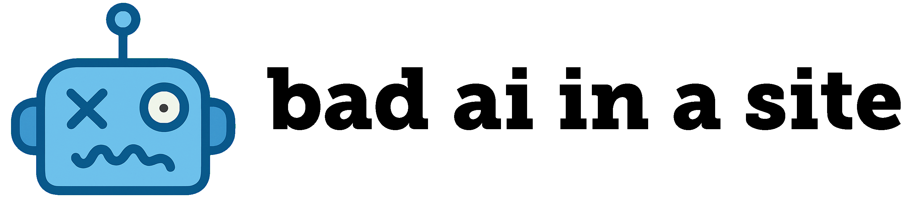

# 🤖 Bad AI In A Site

<div align="center">
  
</div>

A web adaptation of the ["Bad AI In A Box" (BAIIAB) project](https://github.com/lastcoolnameleft/baiiab/) that hosts a hilariously "bad" AI chatbot designed to give intentionally unhelpful, nonsensical, or absurd advice.

## 🎯 Features

- **Menu-driven interaction**: Select from curated prompts instead of free-form queries
- **Mobile-first design**: Optimized for iPhone displays
- **Dual AI backend**: Supports both local LM Studio and OpenRouter API
- **Concise responses**: Limited to ~80 tokens for quick, punchy bad advice
- **Smart formatting**: Basic markdown support with HTML rendering
- **Containerized deployment**: Docker-based with automated GitHub Actions deployment
- **Offline capable**: No external dependencies required for local operation

## 🚀 Quick Start

### Development

1. **Clone and install**:
   ```bash
   git clone https://github.com/edwardjensen/badaiinasite.git
   cd badaiinasite
   npm install
   ```

2. **Set up environment**:
   ```bash
   # Copy the example environment file
   cp .env.example .env
   
   # Edit .env with your configuration
   # Set LM_STUDIO_ADDRESS to your LM Studio server IP
   # Add your actual OPENROUTER_API_KEY for cloud AI backup
   # (It's safe to put real credentials in .env - this file is not tracked by git)
   ```

3. **Run locally**:
   ```bash
   npm run dev
   ```

4. **Open in browser**: http://localhost:3000

### Docker

```bash
# Pull from GitHub Container Registry
docker pull ghcr.io/edwardjensen/badaiinasite:latest

# Run the pre-built container
docker run -d -p 3000:3000 --name badaiinasite ghcr.io/edwardjensen/badaiinasite:latest

# Or build locally
docker build -t badaiinasite .
docker run -d -p 3000:3000 --name badaiinasite badaiinasite
```

## 🏗️ Architecture

```
badaiinasite/
├── src/
│   └── server.js          # Express server with AI integration
├── public/
│   ├── index.html         # Mobile-first frontend
│   ├── styles.css         # Responsive styling
│   └── script.js          # Frontend logic
├── menu.json              # Predefined prompts and categories
├── Dockerfile             # Container configuration
└── .github/workflows/     # Automated deployment
```

## 🤖 AI Configuration

The application supports two AI backends:

### Local AI (LM Studio)
- **Default**: Attempts to connect to LM Studio on `localhost:1234`
- **Supported models**: `google/gemma-3-4b`, `phi-4`, `deepseek-r1-distill-llama-8b`, `deepseek-r1-distill-qwen-7b`
- **Fallback**: Automatically switches to OpenRouter if local AI is unavailable

### Cloud AI (OpenRouter)
- **Models**: `google/gemma-2-9b-it:free`, `deepseek/deepseek-r1-0528:free`
- **Configuration**: Requires `OPENROUTER_API_KEY` environment variable
- **Usage**: Automatically used as fallback or manually selected

## 📱 Usage

1. **Select a category** from the main menu (Advice, Fake Facts, Cocktail, etc.)
2. **Choose a prompt** from the category (Bad, Silly, Cryptic, etc.)
3. **Receive hilariously bad advice** from the AI
4. **Switch AI backends** using the toggle in the header
5. **Try again** for different responses to the same prompt

## 🚢 Deployment

The project features **dual deployment workflows** for maximum flexibility:

### 🏷️ Release Deployment (Full App Updates)
For version releases with code changes:
1. **Create and push version tag**: `git tag v1.0.0 && git push origin v1.0.0`
2. **Automated CI/CD pipeline** builds Docker image with version info
3. **GitHub release** is created with changelog
4. **Production deployment** occurs automatically
5. **Menu reset** - menu.json is updated from repository version

### ⚡ Menu-Only Deployment (Fast Updates)
For quick menu changes without full releases:
1. **Edit menu.json** and push to main branch
2. **Fast deployment** (~30 seconds) via dedicated workflow
3. **No container rebuild** - only menu file is updated
4. **Instant restart** of existing container to apply changes

Both workflows use **Tailscale VPN** for secure server access and **volume mounting** for persistent menu configuration.

### Manual Server Deployment

On the target server:

```bash
# Set environment variables
export LM_STUDIO_ADDRESS="100.106.49.116"  # or your LM Studio server IP
export OPENROUTER_API_KEY="your-api-key"   # optional for cloud AI backup

# Copy and run the deployment script
./deploy-server.sh
```

**Example configurations:**
- **Same server**: `export LM_STUDIO_ADDRESS="localhost"`
- **Different server**: `export LM_STUDIO_ADDRESS="192.168.1.100"`
- **Tailscale network**: `export LM_STUDIO_ADDRESS="100.106.49.116"`

## 🎨 Customization

### Application Settings

Edit `settings.conf` to customize application behavior:

```ini
[ai_response]
# Maximum number of tokens for AI responses
max_tokens = 80
# Temperature setting (0.0 to 1.0, higher = more creative)
temperature = 0.9

[ui]
# Minimum height for response container (pixels)
response_min_height = 120
# Loading timeout (milliseconds)
loading_timeout = 30000
```

### Adding New Prompts

Edit `menu.json` to add new categories or prompts:

```json
{
    "New Category": {
        "Prompt Name": [
            {"role": "system", "content": "You are a [character]"},
            {"role": "user", "content": "Give me [type of response]"}
        ]
    }
}
```

**Quick deployment**: Simply push `menu.json` changes to main branch for instant deployment without rebuilding the entire application!

### Styling

The CSS uses a mobile-first approach with:
- Fixed header with AI status indicator
- Responsive grid layouts for categories/prompts
- Dark theme optimized for readability
- Smooth transitions and hover effects

## 🧪 Development

### Project Structure
- **Frontend**: Vanilla HTML/CSS/JavaScript (no external dependencies)
- **Backend**: Node.js with Express
- **AI Integration**: REST API calls to LM Studio and OpenRouter
- **Containerization**: Multi-stage Docker build with health checks

### Environment Variables
Configure these in your `.env` file for local development:
- `PORT`: Server port (default: 3000)
- `NODE_ENV`: Environment mode (development/production)
- `LM_STUDIO_ADDRESS`: IP address or hostname of LM Studio server (default: localhost)
- `LM_STUDIO_URL`: Full LM Studio endpoint URL (overrides LM_STUDIO_ADDRESS if set)
- `OPENROUTER_API_KEY`: OpenRouter API key for cloud AI fallback

### GitHub Secrets Setup
For automated deployment, configure these secrets in your GitHub repository:

**Go to Settings → Secrets and variables → Actions → New repository secret**

- `DEPLOY_SSH_KEY`: Private SSH key for server access (contents of `~/.ssh/id_rsa`)
- `DEPLOY_HOST`: Tailscale IP address of your deployment server (e.g., "100.106.49.116")
- `DEPLOY_USER`: Username for SSH access to deployment server (e.g., "deploy_user")
- `DEPLOY_MENU_PATH`: Server path for menu.json storage (e.g., "/media/develop/container-configs/badai")
- `LM_STUDIO_ADDRESS`: Tailscale IP address of your LM Studio server (e.g., "100.106.49.116")
- `OPENROUTER_API_KEY`: Your OpenRouter API key for cloud AI backup
- `NPM_DOCKER_NETWORK`: Docker network name for container networking (e.g., "npm_default")
- `TS_OAUTH_CLIENT_ID`: Tailscale OAuth Client ID for GitHub Actions access
- `TS_OAUTH_SECRET`: Tailscale OAuth Secret for GitHub Actions access

**To get Tailscale OAuth credentials:**
1. Go to [Tailscale Admin Console](https://login.tailscale.com/admin/settings/oauth)
2. Generate OAuth Client with tags: `tag:github-actions`  
3. Copy Client ID and Secret to GitHub Secrets

### Testing
```bash
# Test the application locally
npm run dev

# Test Docker build
docker build -t badaiinasite-test .
docker run -p 3000:3000 badaiinasite-test
```

## 🤝 Contributing

This project is based on the original BAIIAB concept by [lastcoolnameleft](https://github.com/lastcoolnameleft/baiiab/). Feel free to contribute improvements, new prompts, or bug fixes!

**Important**: The `.env` file contains sensitive credentials and is excluded from git via `.gitignore`. It's safe to put your real API keys and server addresses in `.env` for local development - this file will never be committed to version control. Always use `.env.example` as a template.

## 📄 License

MIT License - see LICENSE file for details.

---

**Note**: This is a humorous project designed for entertainment. The AI is intentionally programmed to give "bad" advice and should not be used for any real-world decision making! 🤖😄